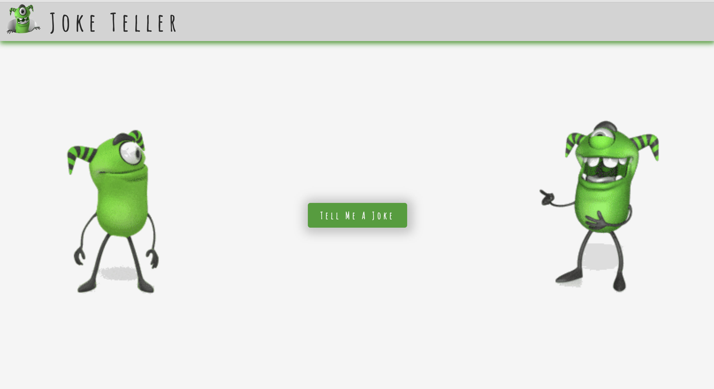

<!-- PROJECT LOGO -->
 

  
  <h3 align="center">Joke Teller</h3>
  

     
    <a href="https://andreinadsc.github.io/joke-teller/">View Demo</a>
    ·
    <a href="https://github.com/andreinadsc/math-spring-game/issues">Report Bug</a>
  

  
Table of Contents

  <ol>
    <li>
      <a href="#about-the-project">About The Project</a>
    </li>
    <li>
        <a href="#built-with">Built With</a>
    </li>
    <li>
      <a href="#getting-started">Getting Started</a>
    </li>
    <li><a href="#contact">Contact</a></li>
  </ol>

## About The Project

A simple joke teller with javascript

(<a href="#readme-top">back to top</a>)

## Built With

* 
* 
* 

(<a href="#readme-top">back to top</a>)

<!-- GETTING STARTED -->

## Getting Started

App that generates random jokes generated from the Joke Programing API. The jokes are dynamically generated and heard aloud using the text-to-speech feature. 

<!-- CONTACT -->

## Contact

María Andreina Da Silva - andreinadsc@gmail.com

(<a href="#readme-top">back to top</a>)

